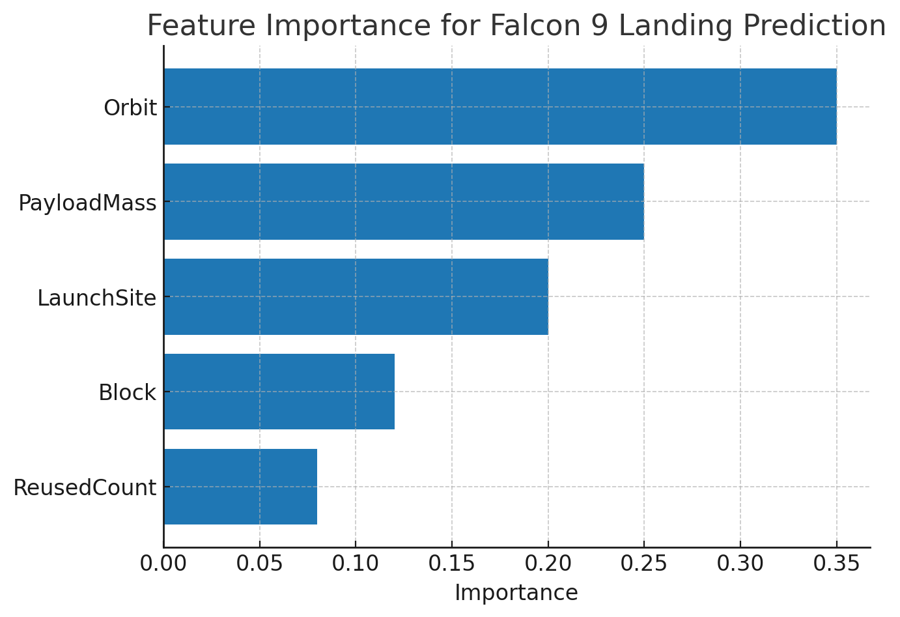

# Portfolio — Javier Gallego  

Welcome to my Data Science Portfolio!  
This repository highlights my capstone project and includes my resume for internship and job applications.  

---

## 👋 About Me  
Hi, I’m **Javier Gallego**, a Master’s student in Data Science with a strong passion for applying data to solve real-world problems.  
I’m seeking opportunities as a **Data Analyst** or **Junior Data Scientist** where I can grow my skills in **Python, SQL, and Machine Learning** while contributing to impactful projects.  

---

## 🚀 Capstone Project: SpaceX Launch Analysis  

**Abstract:**  
This project analyzes SpaceX Falcon 9 launches to predict the success of first-stage landings. Using machine learning models and historical launch data, the goal was to determine the likelihood of success based on factors like payload, launch site, and orbit.  

- 🔗 [Source Code (GitHub Repo)](https://github.com/javigallego02/SpaceX-ASTROTECH-project---Javier-Gallego-)  
- 📊 **Key Findings:** Logistic Regression and Decision Trees achieved strong predictive performance, showing launch site and payload mass as key predictors.  

**Example Visualization:**  
  

---

## 📄 Resume  

[📥 Download my Resume (PDF)](Javier_Gallego_MITRE_Resume.pdf)  

---

## 📬 Contact  
- 📧 Email: javigallego02@gmail.com  
- 💼 LinkedIn: [linkedin.com/in/javier-gallego](https://www.linkedin.com/in/javier-gallego)  
- 🌍 GitHub: [github.com/javigallego02](https://github.com/javigallego02)  
